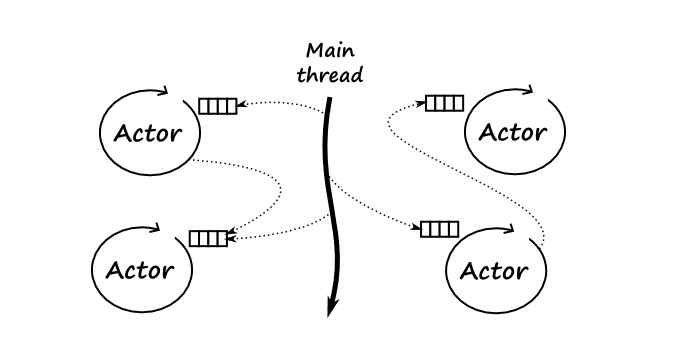

# Garbage Collection

* 가비지는 더이상 사용되지 않는, 정리되지 않거나 유효하지 않은 메모리 공간을 의미
* A, B객체를 생성하고 B가 A를 가리키게 되면 B가 원래 가리키고 있던 객체는 가비지가 된다. (call by reference)
* 객체에 null을 할당하면 가비지가 된다.
* 즉 가비지 컬렉션은 가비지를 수집하여 메모리를 확보하는 행위를 의미한다.
* 가비지 컬렉션이 이루어지는 장소는 메모리의 Heap 영역을 말한다.
* 가비지 컬렉터는 가비지 컬렉션을 수행하는 주체이며 JVM 에 의해 동작이 이루어진다.
* JVM은 GC Thread(=Garbage Collector) 를 통해 메모리를 수집한다.
* JVM은 내부적인 알고리즘에 의해 가비지 컬렉션 동작을 수행한다.
* GC Thread 가 동작 할 때, 해당 스레드를 제외한 애플리케이션의 모든 스레드는 정지된다. (Stop the world)
* 가비지 컬렉션은 Major GC 와 Minor GC 로 나눌 수 있다.
* Major GC 는 Old Generation 에서 동작하고 Minor GC 는 Young Generation 에서 동작한다.
* new 연산자를 통해 새로 생성된 객체는 eden 영역에 위치된다.
* Minor GC 가 발생하면 Eden 영역의 객체는 Survivor 영역으로 이동한다.
* 하나의 Survivor 영역이 가득차면 그 중 살아남은 객체는 다른 Survivor 영역으로 이동된다.
* Old Generation 영역은 Young Generation 에서 살아남은 객체가 존재하는 공간이다.
* Old Generation 영역에 GC(Major GC) 가 발생하면 stop the world 상태가 된다.

