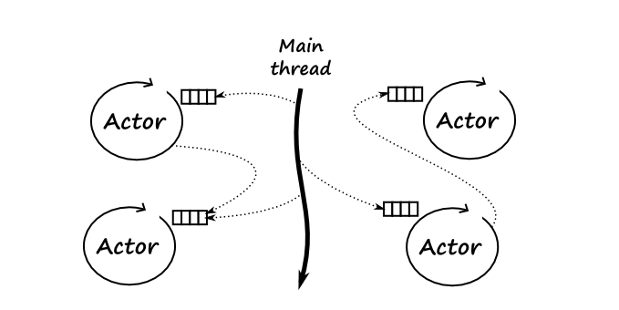

# Reactive Deep Dive

## 1. 시작하기에 앞서 

프로그래머의 숙명은 한정된 리소스를 효율적으로 사용하여 소프트웨어를 구동시키는 것이다.

우리는 이것을 해결하기 위해 소위 "멀티 스레드 프로그래밍" 이라는 키워드를 쉽게 떠올릴 수 있다.

그렇다면 여기서 말하는 스레드는 무엇일까? 프로세스 내에서 작업을 처리하는 단위? 뭔가 이렇게 정의 내리기에는 약간은 어설픈 것 같다.

이와 관련해서 조금은 원론적이고 개념적인 얘기를 해보려고 한다. (조금 지루할 수 있을 듯)

\

### 1.1. 컴퓨터에서 수행하는 작업 

컴퓨터에서 의미하는 작업은 크게 두가지로 나눌 수 있는데 연산과 입출력이다.

우리가 알고 있는 연산이라는 것은 CPU Bound 에 해당하는 것을 의미하고, 입출력은 IO Bound 에 해당하는 데이터 입출력을 말한다.

과거에는 프로그램 처리를 하나씩만 할 수 있었고, 데이터를 읽는 동안 다른 작업은 할 수 없었다.

예를 들어, 어떤 파일을 수정하기 위해 파일을 열었다고 하자. 파일이 열리는 시간 동안은 IO Bound 작업으로 CPU 는 대기(idle) 상태로 사용하지 않아 자원 낭비가 발생한다.

자원 낭비가 발생하지 않도록 데이터를 읽어오는 동안 다른 일을 할 수 있다면 효율적일 것이다.

이를 위해 운영체제에서 등장한 개념이 프로세스와 스레드이며 이를 통해 병행처리의 기반을 만들었다. (병렬처리와 헷갈려서는 안된다)

\

P.S. 병행성과 병렬성에 대해서 생각해 보자

\

### 1.2. 병행 처리 

병행처리를 하는 방법에는 프로세스와 스레드를 통해서 이뤄진다.

병행처리에는 크게 선점형(preemptive)과 비선점형(non-preemptive)이 존재하는데 이 둘은 프로세스에서 작업 시, CPU 개입 여부에 따라 나눌 수 있다.

비선점형은 CPU가 프로세스들의 작업 제어에 관여하지 않는 방식으로 프로세스 스스로가 자발적으로 종료를 알려야 다른 쪽의 프로세스로 제어가 넘어갈 수 있음을 의미하고 (프로세스가 능동적)

선점형은 CPU가 프로세스들의 작업에 관여하므로, 프로세스들을 제어하기 위한 CPU 스케쥴러가 중요한 역할을 한다. (프로세스가 수동적)

여기서 선점형과 비선점형의 공통점은 프로세스 간 메모리 공유가 일어나는 것이다.

프로세스 내 작업 단위인 스레드는 메모리 공유로 인한 경쟁 조건(race condition) 이 발생하는 문제가 있다.

즉, 경쟁 조건이 존재하는 경우 스레드 간 문맥 교환(context switching) 이 생길 수 있고 때에 따라 서로 점유 중인 자원에 서로 접근하려는 시도(deadlock) 나 우선 순위가 낮아 자원에 접근하지 못하는(starvation) 문제가 있을 수 있다.

.png>)

\[그림] 병행성과 병렬성

\

### 1.3. 액터(Actor) 모델 

그렇다면 서로 다른 프로세스가 메모리 공유를 함으로써 문제가 발생하는 것인데 이를 피할 방법은 없을까?

방법은 간단하다. 메모리 공유를 하지 않으면 쉽게 해결되는데, 병행처리의 또 다른 방법으로 액터(Actor) 모델이 있다.

기존의 병행처리에는 공유 자원 처리를 위한 메모리 공유를 막기 위해 lock 을 걸어 프로세스의 접근 제한을 둔다.

즉, locking 상태일 때 공유 자원을 처리하고 있는 프로세스를 제외한 나머지 프로세스가 대기 상태에 있기 때문에 리소스가 비효율적으로 처리될 수 있다.

이런 문제를 막기 위해 액터 모델에서는 메세지(message) 를 기반으로 프로세스 간 통신을 한다.

\

\[그림] 액터(Actor) 모델 동작 방식

출처 : [https://medium.com/@ianjuma/the-actor-model-in-python-with-gevent-b8375d0986fa](https://medium.com/@ianjuma/the-actor-model-in-python-with-gevent-b8375d0986fa)

\

예를 들어, 프로세스 A와 B 가 있다고 해보자.

현재 프로세스 A에서 어떤 작업을 수행하려고 하는데 프로세스 B에서 처리하는 작업이 선행으로 필요한 상태라고 가정해보자.

기존의 병행처리 모델에서는 A가 작업을 수행하기 위해 B의 작업 처리를 기다려야 할 것이다.

이상태는 2가지 문제가 존재한다.

* A가 B의 처리를 기다리는 동안 대기 상태이며, 그동안 A는 어떤 작업도 처리하고 있지 않기 때문에 리소스 낭비가 발생한다.
* A가 작업의 즉시 처리를 원하는 경우 B는 현재 수행 중인 작업에 방해를 받게 된다.

하지만 액터 모델에서는 메세지를 통해 이 문제를 해결한다.

프로세스 A가 프로세스 B에게 작업 처리를 요구하는 메세지를 남기고 프로세스 A 본인은 다른 일을 하러 간다. (메세지 기반 아키텍쳐)

이후, 프로세스 B는 A에게 전달 받은 메세지를 처리하고 다시 A에게 메세지를 통지한다.

액터 모델을 활용하면 "**데이터의 실시간성은 떨어질 수 있으나, 리소스의 효율은 극대화 되는 것이 특징**" 이다.

이와 같은 방법을 사용하는 프로그래밍 언어는 얼랭(Erlang) 과 스칼라(Scala) 가 있다.

지금까지 살펴본 것들은 리액티브에 대한 이해를 위해 알아본 개념들로 이어서 리액티브에 대해 알아보자.

\

## 2. 리액티브 

### 2.1. 리액티브란 무엇인가 

리액티브의 사전적인 의미는 "반응을 보이는"이다. (이게 뭔소린지 잘 모르겠음 계속 알아보자)

쉽게 풀어서 프로그래밍에선 클라이언트가 프로그램을 사용하기 위해 어떤 입력이나 요청을 했을 때, 최대한 빠른 시간 내에 응답하는 것을 말한다.

예를 들어, 마우스 클릭이나 키보드 입력과 같은 이벤트가 있다.

이 개념과 관련해서 이해가 될 수 있도록 리액티브의 핵심 원리를 정리한 [리액티브 선언문(reactive manifesto)](https://reactivemanifesto.org/ko) 이 있다.

그렇다면 최대한 빠른 시간 내에 응답하는 것은 무엇을 의미할까?

리액티브 시스템에서는 빠른 응답을 고려하여 메세지 기반 통신으로 동작하는 시스템이다.

메세지 기반 아키텍쳐는 비동기 방식으로 동작하기 때문에 먼저 동기와 비동기 그리고 블로킹과 논블로킹에 대한 개념을 알아야 한다.

(블로킹과 논블로킹에 대한 설명은 아래에서)

\

리액티브의 개념은 새로운 것은 아닌데 1970년 경에 비동기, 이벤트 주도 프로그래밍 방식을 골조로 두고 세상에 나왔으나

그 당시 대규모의 서비스가 많지 않았기 때문에 큰 인기를 얻지는 못했다.

(이벤트 주도 프로그래밍은 메세지 기반의 아키텍쳐이다)

현재는 트래픽의 증가에 따라 클라이언트가 동시에 1만명(C10K), 10만명(C100K) 또는 그 이상이 동시에 요청을 보냈을 때 어떻게 처리할 것인가에 대한 고민이 많은 프로그래머들 사이에 있었고

그 결과 다시 리액티브의 패러다임이 재조명 되고 있는 추세이며, 현재 많은 기업에서 이 개념을 적용해 서비스를 운영 중에 있다.

\

P.S. 그러나 리액티브한 처리가 항상 옳은 방식은 아니라고 생각한다.

여러 프로그래밍 방식 중 하나이며 대규모 트래픽에 대응해야 하는 순서가 중요하지 않은 서비스의 경우에는 적합 할 수 있겠지만, 이런 방식이 적합하지 않은 프로그램이 존재할 것이다.

\

### 2.2. 비동기 그리고 논블로킹 

동기/비동기와 블로킹/논블로킹의 개념은 병렬 프로그래밍을 얘기할 때 항상 나오는 개념이다.

흔히 동기=블로킹, 비동기=논블로킹으로 헷갈리지만 이는 자바와 자바스크립트가 전혀 연관관계가 없는 것 처럼 같은 맥락이다.

먼저 동기/비동기에 대한 얘기를 해보자.

동기화하다 라는 뜻은 "너와 나에 무언가 상태를 맞춘다" 라는 뜻으로 쓰이며, 이것은 주체가 둘 이상이라는 뜻이다. (태블릿과 스마트폰을 동기화하다라고 얘기하면 조금 이해하기 쉬울까)

어떤 작업이 있다고 가정해보자. 작업이라는 개념은 시작과 끝의 개념이 존재한다.

동기화에 대한 행위는 주체가 둘 이상이 있어야 한다고 앞서 설명했다.

즉, 둘 이상의 주체가 동기적인 작업을 한다는 것은 시작과 끝의 시점을 서로 공유하고 있다는 뜻이다.

(예를 들어 프로세스A 의 작업의 완료를 프로세스B가 신경쓰고 있음을 의미한다)

프로세스 A, B 가 있다고 하면, 프로세스 A가 끝난 후에 프로세스 B가 시작되는 행위 이것은 동기적인 작업이다.

반대로 이 시작과 끝을 맞추지 않는 것은 비동기 작업이라고 볼 수 있다. 프로세스 A가 언제 시작하든 끝나든 관계 없이 프로세스 B는 언제든지 시작과 끝에 대한 시점을 정할 수 있다.

\

블로킹/논블로킹 작업은 프로그램의 제어권이 누구에게 있느냐에 따라 나눌 수 있다.

예를 들면, 함수A 에서 함수B 를 호출한 경우 함수A 의 작업은 잠시 중단되고, 함수B의 작업이 시작된다.

(이때 제어권이 함수A → 함수B 로 넘어간 것임)

함수A의 작업이 계속 진행되려면, 함수B에서 작업을 종료하고 결과를 반환해야 함수A로 다시 제어권이 반환된다. (함수A의 작업이 이어서 진행된다)

이 작업을 블로킹 작업이라고 한다.

반면, 논블로킹 작업은 제어권을 넘겨 주지 않는다.

즉, 함수A 에서 함수B를 호출한 경우 함수A의 작업은 중단되지 않으며, 계속 진행한다. 이때, 함수B 의 작업도 계속 진행된다.

\

아래는 이해를 돕기위해 동기/비동기, 블로킹/논블로킹에 대한 내용을 바탕으로 "클라이언트가 서버로 부터 사용자 정보를 DB에서 조회하는 내용" 의 시나리오를 바탕으로 작성해보았다. (위에서 아래 순서로 시나리오 작성)

| 
 
 | 동기                                                                                                                                                                                                                                                                                                                                                                                                                        | 비동기                                                                                                                                                                                                                                                                                                                                               |
| ----------- | ------------------------------------------------------------------------------------------------------------------------------------------------------------------------------------------------------------------------------------------------------------------------------------------------------------------------------------------------------------------------------------------------------------------------- | ------------------------------------------------------------------------------------------------------------------------------------------------------------------------------------------------------------------------------------------------------------------------------------------------------------------------------------------------- |
| 블로킹         | 
클라이언트가 API 호출하여 작업A가 시작됨

작업A에서 사용자 정보를 조회하기 위해 DB 에서 데이터를 읽어들이는 작업B를 분기함.

작업A 잠시 멈춤과 동시에 작업B 가 시작됨 (<strong>동기</strong> - 작업의 시작과 끝이 공유 O)

작업B가 시작되면서 사용자 정보를 DB에서 조회. 작업A는 여전히 멈춤 상황 (<strong>블로킹</strong>)

작업B가 성공적으로 결과를 반환하고 종료와 동시에 작업A가 재개됨

작업A는 클라이언트에게 사용자 정보를 반환함
                                                                                                           | 
클라이언트가 API 호출하여 작업A가 시작됨

작업A에서 사용자 정보를 조회하기 위해 DB 에서 데이터를 읽어들이는 작업B를 분기함.

작업A 는 계속 진행. 동시에 작업B 가 시작됨 (<strong>비동기</strong> - 작업의 시작과 끝이 공유 X)

작업B가 시작되면서 사용자 정보를 DB에서 조회 하며 시작 즉시 작업A 가 멈춤. (<strong>블로킹</strong>)

작업B가 성공적으로 결과를 반환하고 작업A 가 재개됨

작업A는 클라이언트에게 사용자 정보를 반환함
                                    |
| 논블로킹        | 
클라이언트가 API 호출하여 작업A가 시작됨

작업A에서 사용자 정보를 조회하기 위해 DB 에서 데이터를 읽어들이는 작업B를 분기함.

작업A는 계속해서 작업을 진행하며 작업B가 시작.

작업B의 작업 종료 동기화를 맞추기 위해 작업A 가 작업B의 완료여부를 계속해서 질의(폴링)함 (<strong>동기</strong>)

(작업B의 완료 여부는 DB조회가 끝나고 데이터 반환 즉, 분기의 종료 까지를 의미)

작업B가 시작되면서 사용자 정보를 DB에서 조회. 작업A는 여전히 진행 상황 (<strong>논블로킹</strong>)

작업B가 성공적으로 결과를 반환하고 작업A는 진행 중에 작업B의 완료를 알게됨

작업A는 클라이언트에게 사용자 정보를 반환함
 | 
클라이언트가 API 호출하여 작업A가 시작됨

작업A에서 사용자 정보를 조회하기 위해 DB 에서 데이터를 읽어들이는 작업B를 분기함.

작업A는 계속해서 작업을 진행하며 작업B가 시작.

작업A 는 작업B 의 시작/끝 관련 없이 계속해서 작업 진행 (<strong>비동기</strong>)

작업B가 시작되면서 사용자 정보를 DB에서 조회. 작업A는 여전히 진행 상황 (<strong>논블로킹</strong>)

작업B가 성공적으로 결과를 반환하고 작업A는 진행 중에 작업B의 완료를 알게됨

작업A는 클라이언트에게 사용자 정보를 반환함
 |

\

### 2.3. 리액티브의 특징 

리액티브는 4가지 특징을 갖고 있는데 응답성(responsive), 탄력성(resilient), 유연성(elastic), 메세지 구동 방식(message driven) 이 있다.

여기서 가장 핵심적인 특징은 응답성인데, 클라이언트에게 지연 없이 응답 하는 것이 리액티브 시스템의 궁극적인 목적이기 때문이다.

나머지 3가지 특징(유연성, 신축성, 메세지 주도 방식)은 응답성을 지원하기 위한 것들이며 이에 대해 간략하게 살펴보자.

\

탄력성은 장애를 허용한다는 의미로 쓰인다. 장애 허용(fault tolerance) 은 시스템이 망가지는 것을 보고 있으라는 것이 아니라,

부분적인 장애나 고장이 시스템 전체를 망가뜨리지 않는다는 것을 의미한다.

이는 다른 말로 소프트웨어 스스로가 고장을 감지하고 처리한다는 것이다.

예를 들어 특정 서비스에 N대의 서버가 존재하고 배포됐을 때,

시스템 일부에 문제가 생긴 경우 예외적인 현상이 아니라 평범한 동작의 일부로 받아들이는 것이다.

즉, 시스템의 고장은 소프트웨어의 정상적인 기능의 일부이며, 예외가 아니라 기능으로 인지하는 것이다.

\

유연성은 서비스에 유입되는 트래픽에 따라서 서버의 수가 스케일 아웃 또는 스케일 인을 하는 것을 의미한다.

이와 관련된 예는 AWS 에서 사용하는 오토스케일링을 생각하면 된다.

\

마지막으로 메세지 중심 구동 방식은 소프트웨어를 구성하는 하위 서비스간에 의사소통을 하는 방식의 기본이 메세지를 주고 받는 방식으로 되어 있다는 뜻이다.

이는 서비스의 결합도를 느슨하게 하여 시스템 부하를 막고 안정적인 시스템을 운영할 수 있도록 한다.

메세지 주도 방식은 액터(Actor) 모델에 기인한 것인데, 액터 모델에 대한 의미는 위에 작성된 내용을 살펴보는 것을 추천한다.

\

지금까지 리액티브에 대해서 간략하게 알아보았다. 그렇다면 실제 프로그램에 리액티브 방식의 프로그래밍을 하는 방법은 어떻게 될까?

그 출발점으로 리액티브 스트림에 대해서 설명하고자 한다.

## 3. 리액티브 스트림 

### 3.1. 리액티브 스트림이란 

과거에는 리액티브라는 개념을 각 라이브러리가 구현했었다. 이런 문제로 제대로 된 표준이 없고 각 코드에는 복잡한 병렬 처리 코드가 들어가 있었는데,

이에 대한 표준화된 사양을 만들기 위해 유명회사들이 모여서 소프트웨어 인터페이스로 구체화한 것이 리액티브 스트림이다.

리액티브 표준 사양을 채택한 대표적인 라이브러리는 프로젝트 리액터(Project Reactor), RxJava, JDK9 의 Flow, Akka, Vert.x 등이 있다.

\

리액티브 스트림은 발행자(publisher) 와 구독자(subscriber) 사이의 명세를 나타낸 것이며,

발행자는 데이터를 생성하는 주체이며 구독자에게 데이터를 통지하고, 구독자는 자신이 수용할 수 있는 만큼의 데이터를 처리한다. (이를 백프레셔라고 한다.)

리액티브 스트림 규약에 따르면 데이터 생성 및 통지(소비) 의 모든 행위는 **논블로킹**으로 처리되어야 한다.

\

리액티브 스트림의 핵심은 스트리밍(streaming) 과 백프레셔(backpressure) 이다.

그래서 이 개념을 알면 리액티브 스트림을 보다 쉽게 이해 할 수 있다.

**리액티브 스트림 API 인터페이스**

| `public` `interface Publisher<T> {    public` `void` `subscribe(Subscriber<? super T> s);}` `public` `interface Subscriber<T> {    public` `void` `onSubscribe(Subscription s);    public` `void` `onNext(T t);    public` `void` `onError(Throwable t);    public` `void` `onComplete();}` `public` `interface Subscription {    public` `void` `request(long` `n);    public` `void` `cancel();}` |
| --------------------------------------------------------------------------------------------------------------------------------------------------------------------------------------------------------------------------------------------------------------------------------------------------------------------------------------------------------------------------------------------------- |

\[그림] 구독자와 발행자간 동작 방식

### 3.2. 스트리밍 

스트리밍과 같은 데이터 처리 방식을 알기 전에 기존의 전통적인 데이터 처리 방식에 대해 먼저 짚고 넘어 갈 필요가 있다.

전통적인 데이터 처리 방식은 요청이 도착했을 때 비즈니스 로직을 지나서 DB 까지 조회 후,

응답하는 과정에서 생성된 데이터가 반환될 때 까지 많은 메모리를 사용한다. (작업이 완전히 리턴될 때 까지 메모리를 들고 있음)

이 방식의 문제점은 순간적으로 대량의 요청이 발생했을 때, 서비스에서 문제가 발생할 가능성이 높다. (재수 없으면 리눅스의 OOM Killer 가 동작해서 애플리케이션이 종료되는 사태가 벌어질 수 있음)

스트림 데이터 처리 방식은 처리 되는 그 당시의 데이터만 메모리에 저장되어 있기 때문에,

클라이언트에 반환되기 전까지 불필요한 메모리를 들고 있지 않게 된다.

즉, 대량의 요청이 발생해도 메모리 문제로 인한 서비스에 문제가 발생할 확률이 낮고 상대적으로 스펙이 좋지 않은 서버에서도 대량의 요청을 처리할 수 있다는 장점이 있다.

\

### 3.3. 백프레셔 

앞서 리액티브 스트림은 발행자(pub), 구독자(sub) 사이의 명세를 나타낸 것이라고 언급했다.

즉, 데이터를 처리하는 과정은 2가지 방식이 있는데,

발행자 → 구독자 처럼 구독자에게 수동적으로 전달하거나, (push 방식)

발행자 ← 구독자 처럼 구독자가 능동적으로 처리하는 방식이 있다. (pull 방식)

.png>)

\[그림] Publisher 와 Subscriber 데이터 Pull 방식

출처 : [https://community.oracle.com/tech/developers/discussion/4418040/reactive-programming-with-jdk-9-flow-api](https://community.oracle.com/tech/developers/discussion/4418040/reactive-programming-with-jdk-9-flow-api)

\

\

위의 데이터 처리 과정을 봤을 때, 발행자와 구독자 사이에 처리량의 차이는 존재할 것이다.

이 때, 발행자의 처리 속도가 빠르고 수동적으로 전달하는 구조로 가는 경우 중간에 큐(Queue) 를 두어 처리량의 편차를 해소할 수 있으나,

서비스의 한켠에 큐(Queue) 를 두는 행위 자체가 메모리 사용의 증가를 의미하고 관리를 잘못하는 경우 서비스 전체에 영향(Out of memory)을 줄 수 있다.

\

그러나, 구독자가 처리할 수 있는 만큼 발행자에게 능동적으로 요청한다면 이러한 문제는 해소될 수 있다.

즉, 백프레셔란 구독자가 처리할 수 있는 만큼 발행자에게 요청하여 데이터를 처리하는 것을 의미한다.

\

P.S. 백프레셔는 리액티브 스트림의 핵심인데, 리액티브라는 큰 기조에서 본다면 데이터 처리량의 유연성을 가져감으로써,

클라이언트 요청에 빠른 응답을 주기 위한 골조를 지켜내는 것이 목표가 아닌가 싶다.

데이터 처리 속도 측면에서 봤을 때 만약 구독자가 아니라 반대로 발행자가 속도를 늦츨 수 없다면 어떻게 할까?

리액티브 스트림의 목적은 오직 발행자와 구독자 매커니즘 사이에 경계를 만드는 것이다.

그래서 발행자의 속도를 늦출 수 없다면 버퍼에 담을지, 데이터를 날려버릴지, 실패로 처리할지 결정해야 한다.

\

## 4. 리액티브 프로그래밍 

명령형 프로그래밍 방식과 반대되는 개념으로 선언적 프로그래밍 방식이라고 한다.

선언적 프로그래밍 방식은 데이터의 흐름에 따라 코드가 실행되는 방식이다.

즉, 명령형 프로그래밍 방식은 기능을 실행하는 것이 흐름을 주도하지만 선언적 프로그래밍 방식은 데이터의 변경에 따른 이벤트가 흐름을 주도한다.

리액티브 프로그래밍은 비동기 처리이기 때문에 스레드 안전성을 확보하고자 함수형 프로그래밍을 기반으로 한다.

(함수형 프로그래밍에 대한 내용은 함수형 프로그래밍 문서를 확인 부탁드립니다)

\

## 5. Spring Webflux 

지금까지 리액티브에 대한 개념이 무엇인지 알아봤다. 이를 기반으로 스프링 웹플럭스를 학습한다면 조금 더 이해하기 수월 할 것이다.

스프링 웹플럭스는 스프링에서 리액티브 프로그래밍 방식을 지원하기 위해 만들어졌으며, Spring 5 에서 공개되었다.

스프링은 2003년 발표 이래로 Spring MVC 스택을 지금까지 고수해왔지만, 논블로킹 웹을 지원하기 위해 Spring Webflux 스택이 추가되었다.

Spring Webflux 가 리액티브를 사용하기 위해서는 리액티브 스트림을 사용해야 하는데,

리액티브 스트림은 애플리케이션에 직접 다루기에는 저수준 이므로 스프링 웹플럭스는 Reactor 라는 리액티브 스트림을 구현한 고수준의 리액티브 라이브러리를 채택했다.

Reactor 라이브러리는 Mono 와 Flux 자료구조를 지원하며, 스프링 웹플럭스 방식을 사용한 애플리케이션에서 두 자료구조를 심심치 않게 볼 수 있을 것이다.

\

.png>)

\

출처 : [https://docs.spring.io/spring-framework/docs/current/reference/html/web-reactive.html#webflux-framework-choice](https://docs.spring.io/spring-framework/docs/current/reference/html/web-reactive.html#webflux-framework-choice)

\

### 5.1. 프로그래밍 모델 

스프링 웹플럭스는 논블로킹 모델을 기반으로 두고 있기 때문에 기존 서블릿 모델을 사용하기에는 어렵다.

물론 서블릿 3.1 에서 논블로킹을 위한 API 들을 제공하지만, 본질적으로는 블로킹 방식이기 때문에 전체적인 논블로킹 스택을 구현하기에는 애로사항이 있다.

그래서 기존 서블릿 스택이 아닌 논블로킹을 지원하기 위한 완전히 새로운 리액티브 스택을 만들었는데, 이는 리액티브 스트림과 그 구현체인 리액터를 기반으로 한 새로운 HTTP API 로 구현되어 있다.

웹플럭스는 두가지 프로그래밍 모델을 지원하는데, 기존 Spring MVC 에서 사용하던 어노테이션 기반의 모델과 (Controller - Service - Implementation 과 같이 흔히 우리가 개발할 때 쓰는 패턴)

람다 기반의 라우터 함수 모델 (유사 Node.js 의 Express 와 같음) 을 지원한다.

기본적으로 Netty 프레임워크에서 동작하고 다수의 요청이 하나의 스레드에서 처리된다. (CPU 코어 개수 만큼 스레드 생성이 기본 값)

스레드 당 처리량을 봤을 때 간단히 비교해보자면, Tomcat < Netty < Node.js 로 볼 수 있고, Tomcat 은 1개의 요청=1스레드, Netty 는 N개의 요청=1스레드, Node.js 는 모든 요청=1스레드(싱글 스레드 모델) 이라고 이해하면 된다.

\

### 5.2. 스레드 모델 

스프링 웹플럭스는 기존 스프링 MVC 와는 쓰레드 모델의 기본적인 전략이 다르다.

스프링 MVC 는 기본적으로 서블릿 컨테이너를 사용하기 때문에 다수의 요청이 들어오면 요청에 대한 사용할 수 있는 리소스가 없기 때문에 응답이 잠시 중단될 수 있다.

그래서 애초에 이런 블로킹 상황에 대비하기 위해 스레드 풀을 크게 잡아서 요청을 처리한다. (기본 값 200)

반면 스프링 웹플럭스는 스레드가 중단되지 않는 전제가 있기 때문에 (논블로킹) 작은 스레드 풀을 고정하여 요청을 처리한다.

(CPU 코어의 개수에 맞게 스레드가 생성 됨 - 인텔 CPU 에서는 하이퍼스레딩 기술에 의해 2배수로 생각하면 됨. 4코어x2=8스레드)

스프링 웹플럭스에 기본(default) 설정으로 서버를 가동하면 CPU 코어 수 x 2 만큼 스레드가 생성되고, 서블릿 컨테이너를 사용하도록 하고 서버를 기동하면 블로킹/논블로킹(서블릿 3.1) 을 지원해야 하므로 더 많은 스레드가 생성된다. (톰캣 기본 값 10)

\

### 5.3. WebClient 

아마 많은 팀에서 진행중인 스프링MVC 프로젝트에 논블로킹 모델을 적용하기 위해 WebClient 를 고려중일 것이다.

대부분의 레거시 프로젝트엔 블로킹 모델인 스프링 MVC 로 되어 있을 것이고, 스프링 MVC 는 웹플럭스와 동시에 사용할 수 없기 때문이다.

그렇다고 잘돌아가고 있는 프로그램을 다시 만들어 스프링 웹플럭스를 적용할 필요가 없기 때문에 부분적으로 논블로킹 모델을 사용하고자 "스프링 MVC + 스프링 웹플럭스의 WebClient" 조합을 사용 할 수 있다.

(스프링MVC 프로젝트가 성능적으로 문제가 없다면 굳이 스프링 웹플럭스로 이전하는 것은 권장하지 않는다)

스프링 웹플럭스는 동기/비동기 HTTP 요청을 처리하기 위해 WebClient 를 제공한다. (기존의 RestTemplate 을 대체하며 향후에는 deprecated 될 예정)

WebClient는 내부적으로 HTTP 클라이언트 라이브러리에 의해 처리를 위임하고 클라이언트 라이브러리의 기본 값은 reactor-netty 를 사용한다.

\

## 6. 결론 

스프링 MVC 가 익숙한 개발자가 스프링 웹플럭스를 처음 접했을 때, "리액티브", "선언적 프로그래밍", "함수형 프로그래밍", "넌블로킹", "비동기" 등 이런 키워드들을 접하게 된다.

일단 스프링을 사용하면서 넌블로킹 한번 적용해보고 싶은데? 에서 출발해서 > 스프링 웹플럭스를 공부해보자 > 자연스럽게 위의 키워드들을 접하게 됨 > 당췌 무슨 말인지 잘모르겠음 으로 갈텐데,

이 글의 목적은 "**당췌 무슨 말인지 잘 모르겠음 → 음 대충 무슨 말인지는 알겠네**" 로 가는 것이 목적이다.

리액티브에 대한 개념을 이해하고 왜 이런 개념이 탄생한 것인지, 그리고 스프링 진영에서 리액티브를 적용하기 위해 어떤 노력이 있었는지에 대해 개략적으로 설명해보았다.

해당 문서에서는 예제에 대한 내용은 일부러 작성하지 않았다. (어차피 구글링하면 그런 예제는 널렸을 것임)

리액티브에 대한 개념 이해를 바탕으로 스프링에서 넌블로킹 모델을 적용하고 개발하고 완성하는 과정까지 이 글이 조금이나마 도움이 됐으면 한다.
